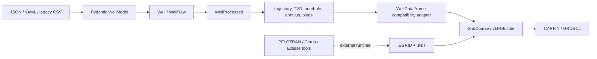

# SCREEN Architecture Manifesto

## Purpose

SCREEN should make one workflow dependable:

> validate a well description, derive its geometry and pressure inputs, translate that information into GaP mesh primitives, and produce a reviewable grid artifact.

The immediate goal is not to modernize every module. It is to make that workflow explicit, testable, and honest about which external tools it needs.

## The Current Shape

SCREEN is currently four overlapping products in one repository:

1. **WellClass**: input models, well trajectory, geometry derivation, pressure/PVT calculations, and plotting.
2. **GaP**: grid geometry, bounding boxes, CARFIN/GRDECL writers, and plotting helpers.
3. **Workflow scripts and notebooks**: experiments that combine the two systems, invoke external simulators, and generate files.
4. **Historical code and assets**: `src/_originals`, `src/PressCalc`, `src/WellViz`, old GaP scripts, duplicated notebooks, and legacy dataframe APIs.

The code is not yet organized around those boundaries. The branch refactor improved the WellClass data model, but the GaP side still consumes legacy pandas-shaped tables.

## Ownership Boundaries

### WellClass owns

- Input schema and validation.
- Unit normalization.
- Measured-depth to true-vertical-depth conversion.
- Hole, casing, cement, plug, and stratigraphy records.
- Well-derived geometry: borehole, annulus, cement bond, plug segments.
- Pressure and PVT calculations.
- Well-focused plots.

The canonical processed API is [`WellProcessed`](../src/WellClass/libs/well_class/well_processed.py). `Well` is the raw validated representation. `hole_casings` is the canonical input name; `holes`, `casings`, and `casing cement` are typed records inside that collection.

### GaP owns

- Reading coarse grid data from `.EGRID` and `.INIT` through `resdata`.
- Computing LGR dimensions and cell coordinates.
- Mapping well geometry to grid indices and bounding boxes.
- Assigning mesh material/permeability fields.
- Writing CARFIN/GRDECL output.

The central GaP path is [`LGRBuilder`](../src/WellClass/libs/grid_utils/LGR_builder.py), supported by `GridCoarse`, `GridRefine`, `LGR_grid_utils`, `LGR_bbox`, and the CARFIN writers in [`src/GaP/libs/carfin`](../src/GaP/libs/carfin).

### The boundary owns

[`WellDataFrame`](../src/WellClass/libs/grid_utils/well_df.py) is currently the compatibility boundary. It converts a processed WellClass object into the pandas fields the existing GaP mesh code expects:

- drilling: `top_msl`, `bottom_msl`, `diameter_m`, `oh_perm`
- casing: `top_msl`, `bottom_msl`, `toc_msl`, `boc_msl`, `diameter_m`, `cb_perm`
- annulus: `top_msl`, `bottom_msl`, `thick_m`
- barriers: GaP-compatible diameter, depth, and permeability fields

This adapter is useful, but it should be a named transition. New WellClass code should not grow more legacy fields such as `drilling`, `casings`, or `barriers`.

## What Is Working Today

- The current Python test suite passes: `8 passed`.
- The WellClass-to-GaP adapter has a controlled vertical-well regression test.
- A real Wildcat input can be converted into `hole_casings`, processed, adapted, and passed through `LGRBuilder` to produce a GRDECL artifact.
- The three canonical notebooks now cover WellClass, GaP grid primitives, and the end-to-end path:
  - [`01_wellclass.ipynb`](../notebooks/01_wellclass.ipynb)
  - [`02_gap_grid.ipynb`](../notebooks/02_gap_grid.ipynb)
  - [`03_wellclass_to_gap.ipynb`](../notebooks/03_wellclass_to_gap.ipynb)

These are important smoke paths, not yet a complete production guarantee.

## The Main Risks

### 1. The tested surface is much smaller than the implementation

The current source coverage is approximately 24%: 2,702 statements, 2,064 missed. Most of the following have no meaningful tests:

- WellClass pressure modules: `pressure.py`, `co2_pressure.py`, `pressure_scenario.py`, `barrier_pressure.py`, `pressure_table.py`.
- WellClass plotting modules.
- Most LGR mesh construction: `grid_refine_base.py`, `LGR_bbox.py`, `LGR_grid_info.py`, `LGR2GaP.py`.
- Most CARFIN writers.
- CSV parsing and parts of YAML/model validation.
- Plug and barrier derivation.

Passing tests currently prove input loading, a few bounding-box helpers, and the new adapter contract. They do not prove the complete simulation workflow.

### 2. The public API is split between two generations

The branch has a typed, list-based `WellProcessed` model, while older notebooks and scripts still use the pandas-era constructor and names. This creates failures such as old parser imports resolving to modules and `Well(...)` receiving removed arguments.

The remedy is not more compatibility aliases everywhere. Choose one canonical API, document the adapter, migrate the three canonical workflows, and then quarantine or remove old recipes deliberately.

### 3. External runtime dependencies are implicit

Python dependencies are declared in [`pyproject.toml`](../pyproject.toml), but several workflows also require tools and artifacts that are not Python packages:

- `runcirrus`
- `runpflotran1.8`
- simulator-generated `.EGRID`, `.INIT`, and restart files
- Eclipse/ECL tooling used by historical scripts
- `ecl` imports in legacy GaP notebooks/scripts

`resdata` is the current Python reader for grid files. The old `ecl`-based scripts should not be treated as supported entry points until they are isolated, documented, or removed.

### 4. Input semantics are not yet fully explicit

Permeability values are required at the WellClass-to-GaP boundary, but the new schema and fixtures do not consistently carry them. The adapter currently accepts explicit `oh_perm`, `cb_perm`, and `barrier_perm` values and fails when they are absent. That is better than silently inventing physics, but the long-term owner of these assumptions should be a modeled configuration object.

Other semantic questions need a written contract:

- Which depth coordinate does each GaP function consume: RKB, MSL, or TVD MSL?
- Are intervals closed, half-open, or allowed to touch at boundaries?
- What should happen when a well extends beyond the grid?
- What is the unit of permeability and pressure at each boundary?
- Are casing cement intervals matched by diameter, name, or explicit identifier?

### 5. File and package structure obscures the supported product

`src/PressCalc`, `src/WellViz`, `src/_originals`, historical GaP scripts, root experiments, and many notebooks coexist with the current code. This makes it hard to know what should be imported, tested, or supported.

The repository needs a support classification before cleanup:

- **Supported**: WellClass models/processing, the GaP mesh path, the three canonical notebooks, and selected CLI workflows.
- **Experimental**: pressure development, plotting prototypes, simulator orchestration.
- **Historical**: `_originals`, old `ecl` scripts, removed standalone applications, superseded notebooks.

## Recommended Plan

### Phase 0: Establish the truth (small, high value)

1. Keep the three canonical notebooks as the only workflow recipes.
2. Add a short support/dependency matrix to the documentation.
3. Add a CI smoke job that runs:
   - all Python tests;
   - the WellClass notebook;
   - the GaP notebook against committed grid fixtures;
   - the end-to-end notebook and checks that a GRDECL file is written.
4. Make test output distinguish pure-Python tests from simulator-required tests.
5. Record the exact Python version and `uv.lock` environment in CI.

**Exit criterion:** a fresh environment can say, automatically, which part of the workflow works and which external tool is missing.

### Phase 1: Lock down the WellClass contract

1. Add parameterized vertical wells: no casing, one casing, multiple casing overlaps, cement gaps, plugs, and no survey.
2. Add one deviated-well fixture with expected MD-to-TVD values.
3. Test unit conversion from feet to meters.
4. Test invalid intervals and invalid Pydantic values.
5. Test `WellProcessed` output schemas and numeric tolerances.
6. Move permeability and other modeling assumptions into an explicit configuration model.

**Exit criterion:** WellClass can be trusted independently of GaP and produces documented, stable records.

### Phase 2: Test GaP as a pure transformation

1. Unit-test bounding boxes and interval-to-grid-index conversion at top, bottom, and boundary depths.
2. Test LGR size calculations with small synthetic grids.
3. Test material assignment for open hole, annulus, cement, and barrier cells.
4. Test CARFIN writers as text transformations: key sections, indices, dimensions, and output closure.
5. Use a tiny committed `.EGRID`/`.INIT` fixture for one integration test.
6. Remove or fix the current mutable-dataframe behavior in mesh builders after tests characterize it.

**Exit criterion:** GaP can prove that a known dataframe and grid produce a known mesh artifact without running PFLOTRAN/Cirrus.

### Phase 3: Make the boundary intentional

1. Rename `WellDataFrame` to a clearly transitional adapter or move it into a GaP input module.
2. Define a typed GaP input record instead of passing loosely specified DataFrames everywhere.
3. Migrate GaP functions from legacy `drilling_df` terminology to `holes_df` or typed hole records.
4. Keep conversion to pandas at the last possible boundary, if pandas remains useful.
5. Add one end-to-end test comparing the current and refactored vertical-well geometry.

**Exit criterion:** WellClass does not know GaP’s historical dataframe vocabulary, and GaP has one documented input contract.

### Phase 4: Clarify operational workflows

1. Separate pure file generation from simulator execution.
2. Replace `os.system` with a small subprocess runner that checks executable availability, return codes, and captured logs.
3. Put simulator-dependent commands behind explicit CLI options or markers.
4. Make output directories temporary by default and avoid mutating input fixtures.
5. Add a dry-run mode that validates paths and writes planned commands without executing them.

**Exit criterion:** a user can run a dry run anywhere and a full run only when the simulator prerequisites are installed.

### Phase 5: Reduce historical noise

Only after the supported path is tested:

1. Archive superseded notebooks and scripts outside the primary navigation.
2. Remove dead modules only when imports and documentation no longer reference them.
3. Delete stale comments that describe the old Well API.
4. Update README and MkDocs navigation to the three canonical recipes.
5. Keep original data/code in a clearly labeled archive or separate history if it is still useful for provenance.

## Issue Candidates

These are good discrete issues, ordered by leverage:

1. **Add CI notebook smoke tests for the three canonical recipes.**
2. **Document the WellClass-to-GaP dataframe contract and units.**
3. **Add vertical and deviated WellProcessed geometry fixtures.**
4. **Cover LGR bounding-box boundary cases.**
5. **Cover CARFIN output writers with golden text fixtures.**
6. **Model permeability assumptions explicitly.**
7. **Add a simulator dependency check and dry-run mode.**
8. **Migrate GaP mesh functions away from legacy `drilling_df` naming.**
9. **Classify and archive historical modules and notebooks.**
10. **Update README/MkDocs around the three supported workflows.**

## Decision Rules

To avoid bloat:

- Do not add an abstraction unless a test demonstrates a repeated boundary or a real ownership problem.
- Prefer fixtures and contract tests over large snapshot files.
- Prefer pure functions for geometry and text generation.
- Keep simulator execution outside unit tests.
- Make units and coordinate systems visible in names or types.
- Fail at the boundary when required physics inputs are missing.
- Do not preserve an old API indefinitely without a migration owner and removal date.
- Every new workflow recipe must either become one of the canonical three or be clearly labeled experimental.

## First Three Work Items

If only three items can be done next, do these:

1. **CI smoke test the canonical notebooks and the end-to-end GRDECL artifact.**
2. **Add WellClass geometry contract tests for vertical, deviated, unit-converted, and invalid wells.**
3. **Add GaP transformation tests for bounding boxes, material assignment, and CARFIN text.**

Those three create the feedback loop needed to improve the rest of the repository without guessing whether behavior changed.
