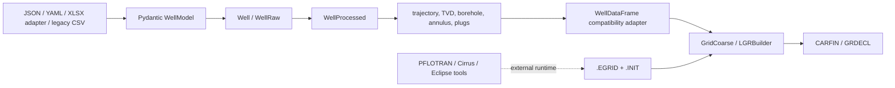

# SCREEN Architecture Manifesto

## Purpose

SCREEN should make one workflow dependable:

> validate a well description, derive its geometry and pressure inputs, translate that information into GaP mesh primitives, and produce a reviewable grid artifact.

The immediate goal is not to modernize every module. It is to make that workflow explicit, testable, and honest about which external tools it needs.

## Document Roles

This manifesto is the architectural source of truth. It defines what SCREEN is supposed to do, which modules own each responsibility, which boundaries are stable, and which limitations are intentional.

The focused roadmaps, such as [`gap_roadmap.md`](gap_roadmap.md), are execution trackers. They record implementation status and the next concrete tasks needed to move toward this architecture; they must not redefine the ownership boundaries or canonical workflow described here. When a roadmap item conflicts with this manifesto, the manifesto takes precedence and the roadmap should be revised.

The simulator-facing file pipeline (`TEMP-0.in` -> `TEMP_GRD.grdecl` -> `tops_dz.inc` -> initialization run -> `.EGRID`/`.INIT` -> CARFIN include) is documented in [`gap.md`](gap.md). Treat that pipeline as operational guidance for reproducible runs and template governance.

The three canonical notebooks are executable explanations of the architecture:

- `01_wellclass.ipynb`: WellClass capabilities.
- `02_gap_grid.ipynb`: GaP grid capabilities and coarse-grid recipe experiments.
- `03_wellclass_to_gap.ipynb`: the JSON-to-LGR integration workflow.

## The Current Shape

SCREEN is currently four overlapping products in one repository:

1. **WellClass**: input models, well trajectory, geometry derivation, pressure/PVT calculations, and plotting.
2. **GaP**: grid geometry, bounding boxes, CARFIN/GRDECL writers, and plotting helpers.
3. **Workflow scripts and notebooks**: experiments that combine the two systems, invoke external simulators, and generate files.
4. **Historical code and assets**: `src/_originals`, `src/PressCalc`, `src/WellViz`, old GaP scripts, duplicated notebooks, and legacy dataframe APIs.

The code is not yet organized around those boundaries. The branch refactor improved the WellClass data model, but the GaP side still consumes legacy pandas-shaped tables.

## Physical Vocabulary

The well model should use the physical construction sequence as its source of truth:

1. **Borehole / drilled hole**: the void created by drilling. It has a boundary and a diameter, but no material assigned inside it.
2. **Casing**: a pipe installed inside the drilled hole.
3. **Annulus**: the remaining space between the casing outside diameter and the borehole boundary.
4. **Cement bond**: the portion of the annulus occupied by injected cement over a depth interval.
5. **Plug**: a cement or mechanical plug occupying a section of the remaining wellbore.
6. **Material region**: the mesh-level classification assigned by GaP, such as `openhole`, `annulus`, `cement_bond_N`, or `barrier_N`.

The terminology must distinguish geometry from material:

- A **hole** is a geometric interval.
- An **annulus** is a geometric region created by casing placement.
- A **cement bond** is a material-filled subregion of an annulus.
- A **plug** is a material-filled interval in the remaining wellbore.
- A **barrier** is a functional or mesh classification; it is not automatically synonymous with a plug.

### Naming map

| Current name | Problem | Canonical direction |
| --- | --- | --- |
| `drilling`, `drilling_df` | Describes the activity, not the resulting hole geometry | `holes`, `holes_df` |
| `hole_casings` | Current combined input collection | Keep as the input container; split into `holes`, `casings`, and `casing_cement` records internally |
| `borehole` | Used for a derived effective opening and sometimes for the original drilled hole | Reserve `borehole` for the derived effective open-wellbore geometry; use `holes` for drilled input intervals |
| `casings`, `casings_df` | Usually clear, but often carries cement fields too | `casings` for pipe geometry; `casing_cement` for cement input/intervals |
| `cement_bond` | Used for both input cement intervals and derived annulus output | Use `casing_cement` for input; `cement_bond` for derived material intervals |
| `barriers`, `barriers_mod_df` | Can mean plugs, functional barriers, or mesh regions | Use `plugs` for physical plugs; use `barrier_regions` for mesh/functional barriers |
| `material == "openhole"` | Mesh material name can be confused with the original hole | Keep as a GaP material label, but document it as a mesh classification |

This is a vocabulary contract, not a request for a repository-wide rename in one change. First document and test the mapping, then rename one ownership boundary at a time. The `WellDataFrame` adapter is the current compatibility seam where legacy names can be translated without leaking them back into WellClass.

## Ownership Boundaries

### WellClass owns

- Input schema and validation.
- Unit normalization.
- Measured-depth to true-vertical-depth conversion.
- Hole, casing, cement, plug, and stratigraphy records.
- Well-derived geometry: borehole, annulus, cement bond, plug segments.
- Pressure and PVT calculations.
- Well-focused plots.

The canonical processed API is `src/WellClass/libs/well_class/well_processed.py` (`WellProcessed`). `Well` is the raw validated representation. `hole_casings` is the canonical input name; `holes`, `casings`, and `casing cement` are typed records inside that collection.

### GaP owns

- Reading coarse grid data from `.EGRID` and `.INIT` through `resdata`.
- Computing LGR dimensions and cell coordinates.
- Mapping well geometry to grid indices and bounding boxes.
- Assigning mesh material/permeability fields.
- Writing CARFIN/GRDECL output.

The central GaP path is `src/WellClass/libs/grid_utils/LGR_builder.py` (`LGRBuilder`), supported by `GridCoarse`, `GridRefine`, `LGR_grid_utils`, `LGR_bbox`, and the CARFIN writers under `src/GaP/libs/carfin`.

### The boundary owns

`src/WellClass/libs/grid_utils/well_df.py` (`WellDataFrame`) is currently the compatibility boundary. It converts a processed WellClass object into the pandas fields the existing GaP mesh code expects:

- drilling: `top_msl`, `bottom_msl`, `diameter_m`, `oh_perm`
- casing: `top_msl`, `bottom_msl`, `toc_msl`, `boc_msl`, `diameter_m`, `cb_perm`
- annulus: `top_msl`, `bottom_msl`, `thick_m`
- barriers: GaP-compatible diameter, depth, and permeability fields

This adapter is useful, but it should be a named transition. New WellClass code should not grow more legacy fields such as `drilling`, `casings`, or `barriers`.

### Module naming conventions

A module's name should say what kind of thing it holds, without needing to open it:

- **Pydantic schemas** end in `_model.py` / `_models.py` (`well_model.py`, `scalar_unit_model.py`). These validate raw input; they are not the runtime object.
- **Dataclasses / the object model** are named after the class they define, in snake_case, one class per module (`well_class.py` → `Well`, `well_processed.py` → `WellProcessed`, `well_raw.py` → `WellRaw`). No suffix needed — the directory (`well_class/`) already signals "this is the object model."
- **Pure-function modules** are named after the computation, not a class, and every function inside starts with a verb: `compute_*`, `verify_*`, `build_*`, `get_*`, `split_*` (`well_computed/borehole.py` → `compute_borehole`, `well_validation.py` → `verify_hole_casings`, `well_computed/well_path.py` → `build_wellpath_object`, `pvt.py` → `get_pvt`).

This is a naming convention to follow going forward, not a rename mandate — `well_model_utils.py` is the one existing inconsistency (it defines pydantic models but doesn't carry the `_model` suffix pattern clearly).

## What Is Working Today

- The current Python test suite passes: `67 passed`, with two expected warnings from sparse Shmin data extrapolation.
- The WellClass-to-GaP adapter has a controlled vertical-well regression test.
- A real Wildcat input can be converted into `hole_casings`, processed, adapted, and passed through `LGRBuilder` to produce a GRDECL artifact.
- The three canonical notebooks now cover WellClass, GaP grid primitives, and the end-to-end path:
  - `notebooks/01_wellclass.ipynb`
  - `notebooks/02_gap_grid.ipynb`
  - `notebooks/03_wellclass_to_gap.ipynb`
- The canonical WellClass notebook now shows a one-page sketch, hydrostatic water and CO2 pressure profiles, and a CO2 P-T density plot.
- The notebook CI workflow executes all three canonical notebooks with the locked `uv` environment.
- The WellClass-to-GaP vocabulary has been migrated incrementally: `holes_df`, `plugs_df`, `barrier_regions_df`, `casing_cement`, `cement_bond`, and canonical `plug_positions` are available while legacy aliases remain at compatibility boundaries.
- PVT hydrostatic calculations accept canonical WellClass depth headers as well as legacy headers.
- Pressure intersection, pressure integration, pressure scenarios, PressureTable, plug geometry, borehole plotting, GaP bounding boxes, CARFIN writers, and mesh material assignment have focused regression coverage.

## Supported vs Deprecated Workflows

Supported for ongoing use:

- Canonical JSON workflow and adapters through WellClass -> GaP.
- Workbook-driven preprocessing adapter (`runscripts/prepare_init_case_from_xlsx.py`) for organized user input.
- Canonical notebooks: `notebooks/01_wellclass.ipynb`, `notebooks/02_gap_grid.ipynb`, `notebooks/03_wellclass_to_gap.ipynb`, `notebooks/04_init_case_preprocessing.ipynb`.

Deprecated or historical (kept as references, not recommended as entry points):

- Scripts under `experiments/legacy/`.
- `_originals` assets and historical notebooks not listed above.
- Legacy CSV-style input recipes for new projects; keep only for backward compatibility and migration.

These are important smoke paths, not yet a complete production guarantee.

### Checkpoint: 2026-08-20

The repository is in a better-observed state, but not a finished or fully standardized state. The main workflow can now be followed and tested from WellClass input through GaP GRDECL generation. The remaining work should be planned from the contracts and vocabulary above, not from another broad refactor.

Completed during this pass:

- Established three canonical workflow notebooks with visual QC.
- Added CI execution for the canonical notebooks.
- Added explicit WellClass-to-GaP permeability inputs.
- Fixed feet-to-metre normalization before TVD derivation.
- Fixed discontinuous-hole validation and cement-material preservation.
- Added pressure, PVT, plug, intersection, CARFIN, mesh-material, and grid-boundary tests.
- Removed broken legacy documentation links and pinned the compatible MkDocs documentation stack.

Known residual risks:

- Legacy aliases and terminology still exist in the adapter, CSV parser, comments, historical scripts, and old notebooks.
- The pressure/PVT examples use explicit illustrative assumptions where the Frigg fixture has no reservoir scenario or temperature-gradient fields.
- The simulator workflows still require external `runpflotran1.8`/`runcirrus` tools and are not part of the pure-Python test suite.
- Strict MkDocs still reports existing docstring/deprecation warnings even though the non-strict build succeeds.
- Overall source coverage remains low outside the paths now tested; pressure and geometry coverage is better, but plotting and simulator orchestration are not comprehensively verified.

### Checkpoint: 2026-08-21 (Pressure engine)

This checkpoint confirms the GaP-first workflow intent and upgrades the canonical GaP notebook from a primitive-only demonstration to a full mesh-construction recipe.

Completed during this pass:

- Upgraded `notebooks/02_gap_grid.ipynb` to run an end-to-end GaP flow from coarse grid and synthetic geometry inputs through `LGRBuilder` and GRDECL generation.
- Added explicit dual-mode refinement comparison in the canonical GaP notebook:
  - `new_way` (log-transition lateral refinement), and
  - `ali_way` (legacy fixed-transition refinement).
- Added numeric lateral-refinement diagnostics (`nx`, min/max `DX`, grading ratio, representative outer/inner transition cells).
- Added side-by-side visual QC of coarse versus refined meshes for both refinement modes.
- Added a notebook flow diagram that documents input-to-LGR transformation stages and where material/permeability assignment occurs.
- Set plotting in the canonical GaP notebook to blocky nearest-neighbor rendering for cell-level QC instead of visually smoothed heatmaps.

Architecture clarifications agreed in this pass:

- **GaP is the core product path** in this repository for grid refinement and mesh artifact generation.
- **WellClass is an upstream provider** of geometry constraints and permeability assumptions to GaP.
- **Pressure/PVT are optional scenario inputs** and should not be treated as required for core GaP meshing workflows.

### Checkpoint: 2026-08-21 (Canonical fixtures and coarse-grid recipe)

The supported JSON-to-LGR contract is now exercised with Wildcat and Smeaheia coarse-grid cases. `WellProcessed` accepts the canonical JSON fixtures, notebook 3 is parameterized by well/grid case, and the integration test covers Wildcat `TEMP-0` plus Smeaheia `TEMP-0` and `GEN_NOLGR_PH2`.

GaP still consumes existing `.EGRID` and `.INIT` files for LGR construction. The first upstream coarse-grid preparation slice is now explicit in `CoarseGridSpec`, `build_vertical_grid_schedule`, and `write_vertical_grid_recipe`: it validates the vertical domain and writes a `TOPS`/`DZ` text recipe, but does not yet generate native `.EGRID`/`.INIT` files or invoke a simulator. The implementation tracker for that work is [the GaP roadmap](gap_roadmap.md).

Refinement mode policy:

- Default and recommended mode for new workflows: `new_way`.
- `ali_way` remains supported for legacy comparability and result back-checking.
- Canonical docs and examples should continue to show both modes where comparison value is high, while using `new_way` as the baseline path.

### Checkpoint: 2026-08-23 (Workbook-driven preprocessing slice)

This checkpoint keeps the GaP architecture unchanged while reducing manual setup overhead for initialization cases.

Completed during this pass:

- Added a standalone preprocessing notebook:
  - `notebooks/04_init_case_preprocessing.ipynb`
- Added reusable init-case staging helpers:
  - `runscripts/prepare_init_case.py`
  - `runscripts/prepare_init_case_from_xlsx.py`
  - `runscripts/create_well_input_workbook.py`
- Added workbook parser support for user-friendly multi-sheet input decks:
  - `src/WellClass/libs/utils/xlsx_parser.py`
- Added template governance and workbook staging regression tests:
  - `tests/gap/test_template_assets.py`
  - `tests/gap/test_prepare_init_case_from_xlsx.py`

Architecture clarifications agreed in this pass:

- The workbook path is an **input adapter**, not a replacement for simulator-generated `.EGRID`/`.INIT`.
- Geometry/topology authority remains in the initialization run path (`TEMP-0.in` + GRDECL + include files).
- The current coarse-grid abstraction remains three-zone (`water`, `overburden`, `reservoir`) with user-configurable counts and an optional target-DZ-driven layer-count calculation.
- Multi-reservoir interval modeling remains a planned extension and is not yet part of the supported contract.

### Checkpoint: 2026-08-24 (Coarse-grid envelope and initialization staging)

The coarse-grid preparation path now includes a typed `CoarseGridEnvelope` derived from processed wells. GaP uses each well's reference X/Y position and treats wells as vertical when sizing the coarse grid; WellClass retains deviation to calculate accurate TVDMSL depths and derived well geometry.

Initialization staging preserves the CIRRUS `co2_db_new.dat` database and removes the post-initialization `TEMP_LGR.grdecl` include from the staged coarse-grid GRDECL. The first simulator run produces only the coarse `.EGRID` and `.INIT`; GaP consumes those files afterward to generate LGR/CARFIN output.

## The Main Risks

### 1. The tested surface is much smaller than the implementation

The current source coverage is approximately 24%: 2,702 statements, 2,064 missed. Most of the following have no meaningful tests:

- WellClass pressure modules: `pressure.py`, `co2_pressure.py`, `pressure_scenario.py`, `barrier_pressure.py`, `pressure_table.py`.
- WellClass plotting modules.
- Most LGR mesh construction: `grid_refine_base.py`, `LGR_bbox.py`, `LGR_grid_info.py`, `LGR2GaP.py`.
- Most CARFIN writers.
- CSV parsing and parts of YAML/model validation.
- Plug and barrier derivation.

Passing tests currently prove input loading, a few bounding-box helpers, and the new adapter contract. They do not prove the complete simulation workflow.

### 2. The public API is split between two generations

The branch has a typed, list-based `WellProcessed` model, while older notebooks and scripts still use the pandas-era constructor and names. This creates failures such as old parser imports resolving to modules and `Well(...)` receiving removed arguments.

The remedy is not more compatibility aliases everywhere. Choose one canonical API, document the adapter, migrate the three canonical workflows, and then quarantine or remove old recipes deliberately.

### 3. External runtime dependencies are implicit

Python dependencies are declared in `pyproject.toml`, but several workflows also require tools and artifacts that are not Python packages:

- `runcirrus`
- `runpflotran1.8`
- simulator-generated `.EGRID`, `.INIT`, and restart files
- Eclipse/ECL tooling used by historical scripts
- `ecl` imports in legacy GaP notebooks/scripts

`resdata` is the current Python reader for grid files. The old `ecl`-based scripts should not be treated as supported entry points until they are isolated, documented, or removed.

### 4. Input semantics are not yet fully explicit

Permeability values are required at the WellClass-to-GaP boundary, but the new schema and fixtures do not consistently carry them. The adapter currently accepts explicit `oh_perm`, `cb_perm`, and `barrier_perm` values and fails when they are absent. That is better than silently inventing physics, but the long-term owner of these assumptions should be a modeled configuration object.

Other semantic questions need a written contract:

- Which depth coordinate does each GaP function consume: RKB, MSL, or TVD MSL?
- Are intervals closed, half-open, or allowed to touch at boundaries?
- What should happen when a well extends beyond the grid?
- What is the unit of permeability and pressure at each boundary?
- Are casing cement intervals matched by diameter, name, or explicit identifier?

The physical vocabulary above is part of the input contract. Every interval should also make its coordinate system, units, and role explicit. A name such as `top_tvd_msl` should not be silently interchanged with `top_rkb`, and a mesh material label should not be used as if it were a physical input type.

### 5. File and package structure obscures the supported product

`src/PressCalc`, `src/WellViz`, `src/_originals`, historical GaP scripts, root experiments, and many notebooks coexist with the current code. This makes it hard to know what should be imported, tested, or supported.

The repository needs a support classification before cleanup:

- **Supported**: WellClass models/processing, the GaP mesh path, the three canonical notebooks, and selected CLI workflows.
- **Experimental**: pressure development, plotting prototypes, simulator orchestration.
- **Historical**: `_originals`, old `ecl` scripts, removed standalone applications, superseded notebooks.

## Recommended Plan

### Phase 0: Establish the truth (small, high value)

1. Keep the three canonical notebooks as the only workflow recipes.
2. Add a short support/dependency matrix to the documentation.
3. Add a CI smoke job that runs:
   - all Python tests;
   - the WellClass notebook;
   - the GaP notebook against committed grid fixtures;
   - the end-to-end notebook and checks that a GRDECL file is written.
4. Make test output distinguish pure-Python tests from simulator-required tests.
5. Record the exact Python version and `uv.lock` environment in CI.

**Exit criterion:** a fresh environment can say, automatically, which part of the workflow works and which external tool is missing.

**Status:** substantially complete. The canonical notebook CI smoke workflow exists and runs with `uv.lock`; simulator dependency reporting and dry-run behavior remain.

### Phase 1: Lock down the WellClass contract

1. Add parameterized vertical wells: no casing, one casing, multiple casing overlaps, cement gaps, plugs, and no survey.
2. Add one deviated-well fixture with expected MD-to-TVD values.
3. Test unit conversion from feet to meters.
4. Test invalid intervals and invalid Pydantic values.
5. Test `WellProcessed` output schemas and numeric tolerances.
6. Move permeability and other modeling assumptions into an explicit configuration model.

**Exit criterion:** WellClass can be trusted independently of GaP and produces documented, stable records.

**Status:** core geometry, unit, validation, plug, pressure, and PVT contracts are covered. Remaining work is broader deviated-well and pressure/PVT scenario coverage plus explicit modeling assumptions.

### Phase 2: Test GaP as a pure transformation

1. Unit-test bounding boxes and interval-to-grid-index conversion at top, bottom, and boundary depths.
2. Test LGR size calculations with small synthetic grids.
3. Test material assignment for open hole, annulus, cement, and barrier cells.
4. Test CARFIN writers as text transformations: key sections, indices, dimensions, and output closure.
5. Use a tiny committed `.EGRID`/`.INIT` fixture for one integration test.
6. Remove or fix the current mutable-dataframe behavior in mesh builders after tests characterize it.

**Exit criterion:** GaP can prove that a known dataframe and grid produce a known mesh artifact without running PFLOTRAN/Cirrus.

**Status:** substantially complete for current bounding-box, material, CARFIN, and end-to-end smoke paths. A smaller committed grid fixture and broader material edge cases remain.

### Phase 3: Make the boundary intentional

1. Rename `WellDataFrame` to a clearly transitional adapter or move it into a GaP input module.
2. Define a typed GaP input record instead of passing loosely specified DataFrames everywhere.
3. Migrate GaP functions from legacy `drilling_df` terminology to `holes_df` or typed hole records.
4. Keep conversion to pandas at the last possible boundary, if pandas remains useful.
5. Add one end-to-end test comparing the current and refactored vertical-well geometry.

**Exit criterion:** WellClass does not know GaP’s historical dataframe vocabulary, and GaP has one documented input contract.

**Status:** in progress. Canonical aliases and internal `holes_df`/`barrier_regions_df` names exist, but legacy aliases and dataframe contracts are still present.

### Phase 4: Clarify operational workflows

1. Separate pure file generation from simulator execution.
2. Replace `os.system` with a small subprocess runner that checks executable availability, return codes, and captured logs.
3. Put simulator-dependent commands behind explicit CLI options or markers.
4. Make output directories temporary by default and avoid mutating input fixtures.
5. Add a dry-run mode that validates paths and writes planned commands without executing them.

**Exit criterion:** a user can run a dry run anywhere and a full run only when the simulator prerequisites are installed.

### Backlog: WellClass pressure scenario engine

WellClass should stay a single object a user can: (1) build well geometry from for both plotting and GaP input, (2) compute brine and CO2 pressure profiles under different scenario definitions, and (3) retrieve key pressure values at specific depths for reporting or later simulation input. Part 1 is done (`WellProcessed`).

Parts 2/3 are now implemented as a collections-based (no pandas) engine. `Pressure` owns one or more named `PressureTable` objects (well-level background curves: temperature, hydrostatic pressure, Shmin) and one or more named `PressureScenario` objects. Scenarios use their selected table while retaining their own `brine_pressure`/`fluid_pressure` arrays and resolved metadata: `z_fluid_datum`/`p_fluid_datum`, `z_store`/`p_store`, `p_delta`, and `z_MSAD`/`p_MSAD`.

The supported scenario anchors are:

1. Fluid datum only, or fluid datum plus an explicit datum pressure or `p_delta`.
2. A shallower store pressure pair, which anchors integration and derives the datum pressure at a supplied datum depth.
3. `z_MSAD`, where `p_MSAD = Shmin(z_MSAD)` anchors integration; an optional `z_store` queries the resulting fluid pressure, and can become the datum when no datum is supplied.

`PressureScenario.display_curves()` keeps complete calculated arrays available while returning full-depth brine plus the display-only fluid segment from MSAD to datum, with exact interpolated endpoints. `Pressure` may be constructed from a WellClass header or from explicit ground elevation, total depth, and RKB reference values.

Remaining/deferred:

1. A `get_values_at_depth(depth)`-style accessor on `PressureScenario` (mirroring `PressureTable.get_values_at_depth`) so specific brine/CO2 pressure values can be pulled out without re-deriving the whole profile.
2. Explicitly deferred: phase-envelope/fluid-composition-aware variable-density PVT (multiple mixtures, bubble/dew-point detection, brine salinity correction) — keep the current single-fluid (`"co2"`) variable-density integration until there is a concrete need.
3. `barrier_pressure.py`'s `compute_barrier_leakage` was left disconnected — it referenced a legacy `Well` API (`well.barrier_perm`, `well.compute_barrier_props`) that no longer exists, and was removed from `Pressure`. Re-wiring barrier leakage estimation against the current `Well`/`WellProcessed` API is separate future work.

**Exit criterion:** a WellClass user can define 2+ named pressure scenarios from a well and read back brine/CO2 pressure at a chosen depth, with test coverage, without pandas and without GaP involvement. Met except for the `get_values_at_depth` accessor.

**Status:** substantially complete. `Pressure`/`PressureScenario`/`PressureTable` are implemented, tested (`tests/well_class/test_pressure.py`, `tests/well_class/test_pressure_table.py`), and demonstrated in `01_wellclass.ipynb` through datum, explicit-datum-pressure, store-anchored, and MSAD-anchored scenarios.

### Checkpoint: 2026-08-21

The WellClass pressure path now has a coherent object boundary: `Pressure` owns background tables; `PressureScenario` owns its resolved anchor metadata and calculated fluid/brine curves. This is the point to pause pressure API expansion. The next pressure increment should be the small read-only `get_values_at_depth` accessor, not another anchor type or PVT model. Bundled CO2 PVT constants now live in package-owned data and are the normal `Pressure` default; `pvt_path` remains an explicit override for alternative collections.

### Phase 5: Reduce historical noise

Only after the supported path is tested:

1. Archive superseded notebooks and scripts outside the primary navigation.
2. Remove dead modules only when imports and documentation no longer reference them.
3. Delete stale comments that describe the old Well API.
4. Update README and MkDocs navigation to the three canonical recipes.
5. Keep original data/code in a clearly labeled archive or separate history if it is still useful for provenance.

## Issue Candidates

These are good discrete issues, ordered by leverage:

1. **Add CI notebook smoke tests for the three canonical recipes.**
2. **Document the WellClass-to-GaP dataframe contract and units.**
3. **Add vertical and deviated WellProcessed geometry fixtures.**
4. **Cover LGR bounding-box boundary cases.**
5. **Cover CARFIN output writers with golden text fixtures.**
6. **Model permeability assumptions explicitly.**
7. **Add a simulator dependency check and dry-run mode.**
8. **Migrate GaP mesh functions away from legacy `drilling_df` naming.**
9. **Classify and archive historical modules and notebooks.**
10. **Update README/MkDocs around the three supported workflows.**
11. **Publish and enforce the wellbore physical vocabulary.**
12. **Rename the WellClass-to-GaP boundary from drilling/casings/barriers to holes/casings/barrier regions.**
13. **Build a collections-based, multi-scenario WellClass pressure engine (brine + CO2, key-depth lookups) — see the pressure scenario engine backlog above.**

## Decision Rules

To avoid bloat:

- Do not add an abstraction unless a test demonstrates a repeated boundary or a real ownership problem.
- Prefer fixtures and contract tests over large snapshot files.
- Prefer pure functions for geometry and text generation.
- Keep simulator execution outside unit tests.
- Make units and coordinate systems visible in names or types.
- Fail at the boundary when required physics inputs are missing.
- Do not preserve an old API indefinitely without a migration owner and removal date.
- Every new workflow recipe must either become one of the canonical three or be clearly labeled experimental.

## First Three Work Items

If only three items can be done next, do these:

1. **CI smoke test the canonical notebooks and the end-to-end GRDECL artifact.**
2. **Add WellClass geometry contract tests for vertical, deviated, unit-converted, and invalid wells.**
3. **Add GaP transformation tests for bounding boxes, material assignment, and CARFIN text.**

The next naming task after these tests is to create a small typed boundary model or named adapter result using the vocabulary above. Do not start with a global search-and-replace; use the adapter and its tests to make each rename observable.

Those three create the feedback loop needed to improve the rest of the repository without guessing whether behavior changed.
