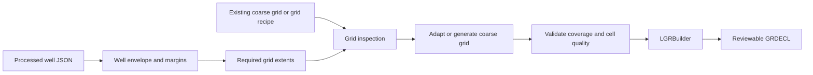

# GaP Roadmap

## Current Constraint

The current `LGRBuilder` assumes that a suitable coarse `.EGRID` and `.INIT` case already exists. It refines that grid around the well, assigns material and permeability regions, and writes a GRDECL artifact. This is the tested product path and should remain stable while coarse-grid accommodation is designed.

The first pure-Python slice is now available as `CoarseGridSpec` and `build_vertical_grid_schedule` in `src/WellClass/libs/grid_utils/coarse_grid.py`. It creates a deterministic water/overburden/reservoir `DZ` schedule and validates that a supplied processed well fits within the configured top and bottom depths. It does not write `.EGRID`/`.INIT` files or invoke a simulator yet.

## Future Coarse-Grid Accommodation

The desired capability is to make or adapt a coarse grid so the well can be represented before LGR refinement. A future implementation should separate this into an explicit stage:

Candidate responsibilities:

1. **Well envelope:** derive lateral radius, top/bottom depth, and configurable safety margins from `WellProcessed` geometry.
2. **Grid coverage:** verify that the coarse grid contains the envelope and report which bounds or layers are insufficient.
3. **Grid adaptation:** split or extend coarse cells where needed, preserving coordinate systems, units, and existing properties.
4. **Grid recipe:** support a pure-Python synthetic/coarse-grid recipe for tests and a separate simulator-backed writer for production cases.
5. **Quality checks:** reject inverted cells, zero/negative dimensions, uncovered well intervals, and ambiguous depth references before LGR construction.

## Design Constraints

- Do not hide grid creation inside `LGRBuilder`; keep coarse-grid preparation as a named upstream boundary.
- Keep simulator execution optional and explicit.
- Make margins, target cell sizes, coordinate system, and depth range configuration values rather than constants.
- Add a small synthetic-grid test before integrating with PFLOTRAN/CIRRUS.
- Preserve the current pre-existing-grid workflow as a regression path.

The legacy recipes in `experiments/legacy/` are useful references for template copying, tops generation, pressure initialization, and simulator orchestration. They should inform this design but should not be imported as the new implementation.