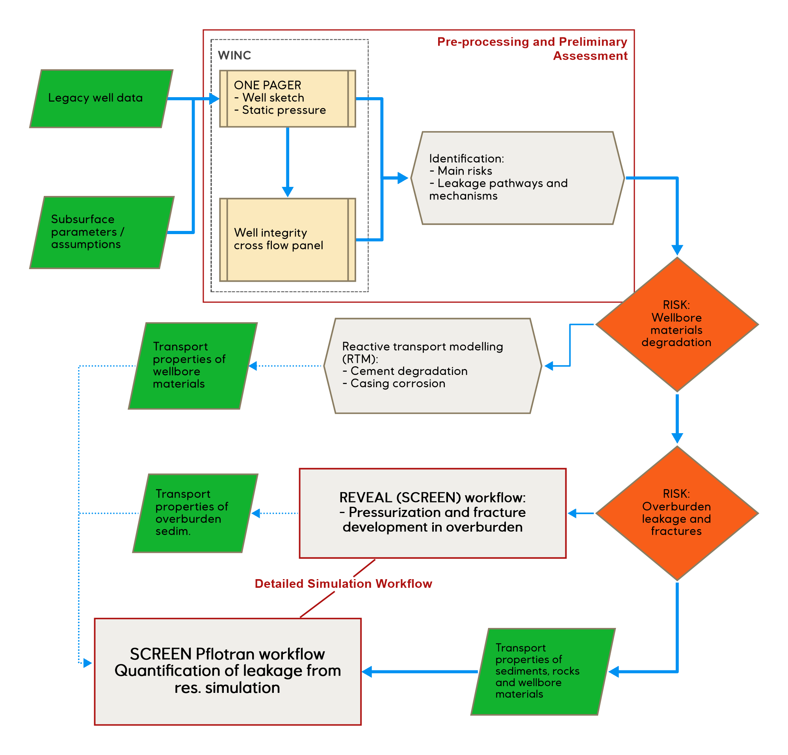
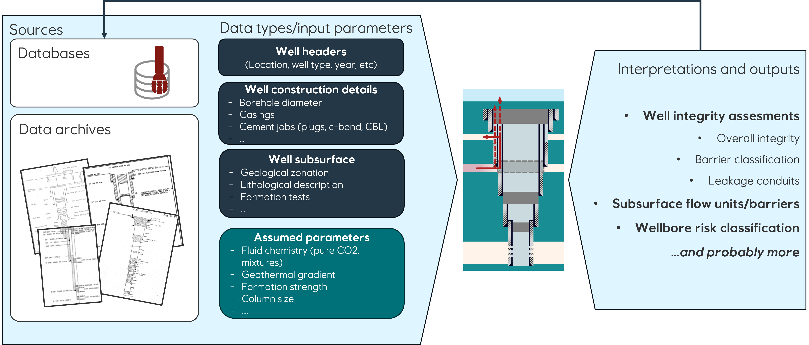

## Introduction

The SCript-based Risk Estimation of well leakage in Early phase evaluatioN (SCREEN) project targets legacy well assessment for Carbon Capture and Storage (CCS) projects. Given that abandoned or inactive wells can serve as pathways for CO2 leakage, rigorous risk assessments and integrity evaluations are crucial [1; 2].

SCREEN provides a script-based workflow to streamline analysis in legacy well evaluations, improving data processing and analysis for well integrity engineers and subsurface teams.

Two primary modules constitute the SCREEN project: the pre-processing and preliminary assessment module, and the detailed simulation workflow using the PFLOTRAN tool (Figure 1.1). Preliminary assessments apply to all legacy wells, contingent on data availability, and are a focus of ongoing development for the WINC deliverable. The simulation module serves to quantify potential leakage rates where necessary after initial assessment outcomes.

While the simulation workflow includes modelling of key well integrity risks, it is not comprehensive for scenarios like material degradation or overburden fracturing. Specialists must assess these risks using different tools. For overburden leakage risks, a REVEAL-based workflow, stemming from SCREEN, is recommended (Figure 1.1).

## Data Preparation

Data preparation is a prerequisite for employing SCREEN workflows. This task involves gathering wellbore and subsurface data necessary for subsequent analysis, focusing on completeness for reliable evaluation outcomes.

The required data types for legacy well analyses are:

- **Well Headers**: Data such as well location, type, time of abandonment, and water depth.
- **Well Construction Details**: Information on drilling, completion, and abandonment processes, including borehole sizes, casings, and cement records.
- **Subsurface Information**: Geological data, including lithology and formation tests, required to identify potential barriers and flow paths.
- **Assumed Parameters**: Estimates for parameters such as reservoir fluid composition, geothermal gradient, overburden strength, and CO2 column size or CO2-water contact depth, in the absence of direct measurements.

Data can originate from databases such as SMDA and Wellcom, but it is the users' responsibility to input this data into SCREEN workflows manually or via other applications. Notably, the implementation within the WINC platform automates data retrieval from databases prior to running the SCREEN modules (Figure 1.2).

For clarification, SCREEN workflows do not interact with databases directly but rely on user-provided data, manually entered or sourced from other systems.

## References

1. ISO. (2017). ISO 27914:2017 Carbon dioxide capture, transportation and geological storage — Geological storage. Retrieved from [https://www.iso.org/standard/64148.html](https://www.iso.org/standard/64148.html)
2. DNV. (2019). DNV-RP-J203 Geological storage of carbon dioxide. Retrieved from [https://www.dnv.com/oilgas/download/dnv-rp-j203-geological-storage-of-carbon-dioxide.html](https://www.dnv.com/oilgas/download/dnv-rp-j203-geological-storage-of-carbon-dioxide.html)
