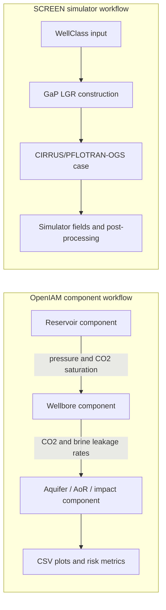
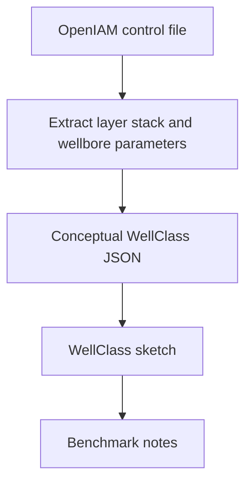
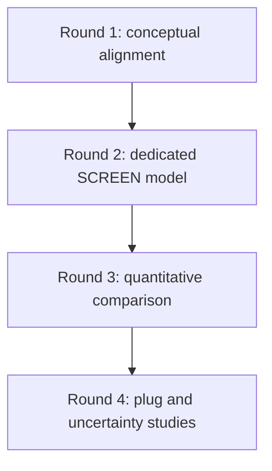

# OpenIAM and SCREEN Benchmarking

## Purpose

OpenIAM and SCREEN both support reasoning about leakage risk from legacy wells in CO2 storage settings, but they are not direct substitutes. A useful comparison should start by documenting what each tool is designed to represent, then define a common physical scenario and only compare quantities that have the same meaning in both workflows.

The short conclusion is:

> OpenIAM and SCREEN are not directly benchmarkable by running a default example from each code and comparing the numbers. OpenIAM is a component-based integrated assessment model with reduced-order wellbore, reservoir, aquifer, and risk components. SCREEN is a WellClass-to-GaP-to-CIRRUS workflow that builds a gridded simulation representation of a well and its surrounding domain. A fair comparison requires a purpose-built case with matched stratigraphy, leakage targets, pressure assumptions, material properties, and output definitions.

This page gives a walkthrough for building that comparison without overstating equivalence.

## External Repositories

Neither OpenIAM nor the leakage tool prototype is vendored into this SCREEN repository. The benchmark notebooks expect both to be cloned locally under `work/benchmark/repos/`, which is ignored by SCREEN and should not be committed here. Losing these local checkouts (and anything else under `work/`) when switching branches or committing is expected and not a problem — just re-clone them as shown below.

### OpenIAM

The upstream project is available at [NRAP / NRAP-Open-IAM on GitLab](https://gitlab.com/NRAP/OpenIAM). Treat that repository, its license, and its documentation as the source of truth for OpenIAM behavior and installation requirements.

To run the local benchmark notebook, clone OpenIAM under SCREEN's ignored `work/` folder:

```bash
mkdir -p work/benchmark/repos
git clone https://gitlab.com/NRAP/OpenIAM.git work/benchmark/repos/OpenIAM
```

The notebook `notebooks/07_round1_openiam_screen_benchmark.ipynb` expects the checkout at exactly this path:

```text
work/benchmark/repos/OpenIAM
```

### Leakage Tool Prototype

The leakage tool prototype (`leakage_model` package) is a separate internal repository, not published to PyPI. Clone it under the same ignored `work/` folder:

```bash
mkdir -p work/benchmark/repos
git clone git@gitlab.sintef.no:1630/research-projects/legacy/leakage_tool_prototype.git work/benchmark/repos/leakage_tool_prototype
```

The notebooks `notebooks/08A_round2_leakage_tool_screen_reproduction.ipynb` and `notebooks/08B_smeaheia_to_leakage_tool_adapter.ipynb` expect the checkout at exactly this path:

```text
work/benchmark/repos/leakage_tool_prototype
```

Both notebooks add this path (and, for 08A, its `examples` subfolder) to `sys.path` so that `leakage_model` and its helper modules can be imported without installing the package.

Keeping both checkouts under `work/` avoids committing the external repositories or their generated outputs into SCREEN.

## How the Tools Think

OpenIAM assembles a system from components. A reservoir component can provide pressure and CO2 saturation to a wellbore component; the wellbore component can estimate leakage rates into aquifers or the atmosphere; aquifer or area-of-review components can consume those leakage rates. Many examples are designed for sensitivity, uncertainty, screening, and area-of-review studies.

SCREEN starts from well description and simulator geometry. WellClass validates and processes the well construction and stratigraphy, GaP maps the processed well into a local grid refinement and CARFIN/GRDECL-style artifacts, and CIRRUS/PFLOTRAN-OGS runs the gridded simulation. The workflow is closer to a detailed case-building pipeline than to a reduced-order integrated assessment model.



## OpenIAM Wellbore Options

OpenIAM contains several wellbore pathways that are relevant to leakage benchmarking. The best choice depends on the question.

| OpenIAM option | Typical use | Main representation | SCREEN comparison difficulty |
| --- | --- | --- | --- |
| `OpenWellbore` | Conservative or worst-case open conduit leakage | Drift-flux style open wellbore/tubing/casing leakage, optionally with critical pressure | High, unless SCREEN is configured as an open high-permeability pathway |
| `MultisegmentedWellbore` | Effective leakage through impaired cement across layered geology | 1D multiphase Darcy flow through segments, with leakage into multiple aquifers | Moderate, if SCREEN is collapsed to equivalent leakage intervals or a matching grid is built |
| `MultisegmentedWellboreAI` | Similar target as multisegmented wellbore with an ML model | Data-driven/ML version of multisegmented behavior | High, because the ML training domain and dependencies add another abstraction layer |
| `CementedWellbore` / `CementedWellboreWR` | Reduced-order cemented well leakage | FEHM-derived reduced-order model with parameter bounds | Moderate to high, because SCREEN plug/cement geometry must be mapped to ROM parameters |
| `WellData` | Well description, categorization, and visualization | Holes, casings, reservoirs, plugs, and annuli represented as data arrays | Useful for visual comparison, not by itself a leakage simulator |
| `SALSA` | Aquifer/shale hydraulic response and leakage status studies | Standalone aquifer-aquitard/well leakage model with plugged/unplugged shale status | Potentially useful for plugged/unplugged concepts, but not direct WellClass plug geometry |

The key point is that OpenIAM often works with effective parameters and component-level outputs. SCREEN can represent explicit well construction, but its output must be post-processed into the same quantities if a numerical comparison is desired.

## SCREEN Representation

SCREEN separates three concerns:

1. **WellClass** stores and processes the physical well description: header, survey, holes, casings, casing cement, plugs, and stratigraphy.
2. **GaP** converts the processed well into grid refinement and material assignments.
3. **CIRRUS/PFLOTRAN-OGS** runs the staged model and produces grid/restart outputs.

The workbook path makes these boundaries explicit. Physical well data are converted to canonical WellClass JSON, while `GridPolicy` and `SubsurfaceAssumptions` parameterize the simulator case.

```text
XLSX -> well_input.json -> parameterized TEMP-0.in
     -> CIRRUS initialization -> .EGRID + .INIT
     -> WellProcessed -> WellDataFrame -> LGRBuilder
     -> TEMP_LGR.grdecl -> final CIRRUS simulation
```

This gives SCREEN a richer physical well representation, but it also means a comparison requires more setup: the overburden, aquifer intervals, pressure regions, material properties, grid resolution, and leakage receptors must be represented deliberately.

## Why Default Examples Are Not Direct Benchmarks

### Different Model Purposes

OpenIAM examples are often screening or integrated assessment examples. They may demonstrate deterministic forward runs, Latin hypercube sampling, parameter studies, area-of-review plots, or aquifer impact models.

SCREEN examples are simulator-preprocessing and grid-construction examples. They focus on turning well construction and stratigraphy into a gridded representation that can be run externally.

Example: OpenIAM `ControlFile_ex2c.yaml` demonstrates how initial pressures can be enforced for an `AnalyticalReservoir` plus `MultisegmentedWellbore`. A SCREEN workbook example demonstrates how a well and grid policy become a CIRRUS case. Those are different demonstrations.

### Different Leakage Pathway Abstractions

OpenIAM wellbore components usually expose effective parameters such as:

```yaml
logWellPerm: -13.5
logAquPerm: -12.0
wellRadius: 0.05
```

SCREEN can assign properties to explicit well-construction elements:

```text
open hole permeability
casing cement permeability
cement plug permeability
overburden permeability
reservoir permeability
transmissibility multipliers around casing
```

These can be made conceptually compatible, but only after deciding how a detailed SCREEN geometry should collapse into OpenIAM's effective parameter space, or how OpenIAM's effective pathway should be expanded into a SCREEN grid.

### Different Plug Semantics

SCREEN/WellClass can represent cement plugs as physical intervals with top and bottom depths. OpenIAM has plug-related concepts, but they appear in different places:

- `WellData` can store plug data for well condition processing and visualization.
- SALSA can mark shale intervals as plugged or unplugged with parameters such as `leakingWell#StatShale#`.
- Wellbore leakage components such as `MultisegmentedWellbore` typically model leakage through effective segment permeability rather than explicit plug geometry.

Therefore, a plug comparison is not direct. It needs a mapping rule, for example: a SCREEN cement plug interval becomes a low-permeability OpenIAM well segment, or an OpenIAM plugged shale status becomes a SCREEN barrier interval with selected permeability.

### Different Stratigraphy and Overburden Handling

OpenIAM examples often use explicit shale/aquifer layer stacks and report leakage into named aquifers. SCREEN's current canonical template path is simpler: it builds water/overburden/reservoir regions, then refines around the well. To match OpenIAM, SCREEN must be given a custom case where overburden flow units are separated and assigned appropriate properties.

Example OpenIAM-style layering:

```text
surface
shale3
aquifer2      <- shallow leakage receptor
shale2
aquifer1      <- deeper leakage receptor
shale1
reservoir     <- source
```

A comparable SCREEN case would need these intervals represented in the WellClass stratigraphy, vertical grid, material assignment, pressure initialization, and output extraction.

### Different Boundaries and Reference Conditions

OpenIAM examples can be onshore or offshore depending on setup. The `ControlFile_ex2c.yaml` case is treated as onshore because it uses a surface datum pressure of `101325 Pa` and no seawater column.

Several SCREEN examples are offshore and include a water column. Those examples should not be compared numerically to an onshore OpenIAM case without changing the datum, water depth, pressure initialization, and reservoir assumptions.

### Different Output Meanings

OpenIAM writes component-level CSV outputs such as leakage rate and accumulated mass:

```text
CO2_aquifer1 [kg/s]
CO2_aquifer2 [kg/s]
mass_CO2_aquifer1 [kg]
mass_CO2_aquifer2 [kg]
```

SCREEN/CIRRUS produces simulator outputs. To compare with OpenIAM, those outputs must be reduced to equivalent metrics: flux into a named aquifer interval, cumulative mass into that interval, reservoir pressure at a comparable location, and saturation driver values.

## A Practical Walkthrough

### Step 1: Choose the Benchmark Question

Start by deciding what is being compared. Reasonable questions include:

- How do effective well permeability assumptions influence leakage rate?
- How different are reservoir-to-aquifer leakage predictions under a simple onshore layer stack?
- Can SCREEN reproduce the qualitative sensitivity trends from an OpenIAM wellbore component?
- How does explicit plug geometry in SCREEN translate into OpenIAM's effective or plugged/unplugged abstractions?

Avoid beginning with the question "which code is faster or more accurate?" until the physical setup and output quantities are aligned.

### Step 2: Pick the OpenIAM Component Family

For an initial legacy-well benchmark, `MultisegmentedWellbore` is often the most useful OpenIAM starting point because it can represent leakage into multiple aquifers through an effective well path. `OpenWellbore` is better for a conservative open-conduit case. `CementedWellbore` is useful when the ROM assumptions fit the intended cemented-well scenario. SALSA is useful for aquifer/shale leakage status studies.

### Step 3: Convert the Physical Story, Not Just the File

The physical story should be written independently of either code:

```text
onshore or offshore setting
depth datum
reservoir top and thickness
overburden shale/aquifer layering
target leakage receptors
well pathway type
effective permeability or plug/barrier assumptions
initial pressure and saturation drivers
simulation duration
```

Only after this neutral description exists should inputs be generated for OpenIAM and SCREEN.

### Step 4: Use WellClass for Visualization

WellClass is useful even when the final comparison is not yet quantitative. A conceptual sketch can show the interpreted OpenIAM layer stack and the assumed leakage pathway.



The notebook `notebooks/07_round1_openiam_screen_benchmark.ipynb` performs this first visualization step for a simple no-plug effective-leakage case. The generated files are written under:

```text
work/benchmark/cases/round1_openiam_screen/
```

The sketch should be labelled as conceptual. If casing and annulus dimensions are added only for plotting, they are not OpenIAM model inputs.

### Step 5: Build a Dedicated SCREEN Case

For a quantitative comparison, do not use an unrelated SCREEN example. Build a dedicated SCREEN case that matches the neutral benchmark story.

Required SCREEN-side work may include:

- onshore/offshore datum selection matching the OpenIAM case
- vertical grid layers that honor the same shale/aquifer/reservoir intervals
- material properties for each shale, aquifer, and reservoir interval
- pressure initialization consistent with OpenIAM pressure gradients or enforced pressures
- a well pathway whose permeability represents the same effective leakage assumption
- simulator outputs or post-processing for leakage into the same receptor intervals

This is the step where the comparison becomes meaningful. Without it, the exercise is only a qualitative model-structure comparison.

### Step 6: Compare Only Like-for-Like Quantities

A defensible first comparison table should include:

| Quantity | OpenIAM source | SCREEN source |
| --- | --- | --- |
| Reservoir pressure driver | reservoir component CSV | pressure at comparable grid location/depth |
| CO2 saturation driver | reservoir component CSV | saturation at comparable grid location/depth |
| CO2 leakage rate to aquifer | wellbore component CSV | flux into matching aquifer interval |
| Brine leakage rate to aquifer | wellbore component CSV | flux into matching aquifer interval |
| Cumulative CO2 leaked mass | accumulated leakage CSV | integrated flux/mass balance into matching interval |
| Case geometry | control-file stratigraphy | WellClass JSON, grid recipe, and generated grid |

Runtime and solver cost can be reported, but they should not be the primary benchmark until the physics and outputs are aligned.

## Example: OpenIAM ex2c as a Round 1 Anchor

`ControlFile_ex2c.yaml` is a useful example because it is small, deterministic, and reports leakage into two aquifers. It uses an `AnalyticalReservoir` connected to a `MultisegmentedWellbore`, with enforced initial pressures.

The leakage path is reservoir-to-aquifers, not primarily reservoir-to-atmosphere:

```text
surface
shale3
aquifer2
shale2
aquifer1
shale1
reservoir
```

The selected outputs are:

```yaml
Outputs: [CO2_aquifer1, brine_aquifer1,
          CO2_aquifer2, brine_aquifer2]
```

This is enough for a conceptual WellClass sketch and for defining comparison quantities. It is not enough for a direct numerical comparison against SCREEN unless a matching SCREEN model is built.

## Recommended Benchmark Stages



### Round 1: Conceptual Alignment

Document the OpenIAM component choice, layer stack, leakage pathway, receptor units, and effective parameters. Use WellClass to visualize the interpreted case.

### Round 2: Dedicated SCREEN Model

Build a SCREEN/CIRRUS case with matching stratigraphy, pressure assumptions, material properties, and output extraction. This may require extending the current template assumptions if multiple overburden aquifers must be represented explicitly.

### Round 3: Quantitative Comparison

Run both tools and compare leakage rates, cumulative masses, pressure drivers, and saturation drivers for the same receptors and time points.

### Round 4: Plug and Uncertainty Studies

Introduce explicit SCREEN cement plugs, OpenIAM effective segment reductions, SALSA plugged/unplugged shale statuses, or uncertainty ranges. Report these as model-translation studies, not one-to-one verification.

## Recommended Wording

Use this wording when describing the current state:

> OpenIAM and SCREEN address overlapping legacy-well leakage questions, but they are not directly benchmarkable from their default examples. OpenIAM is a component-based integrated assessment framework using reduced-order or analytical components for reservoir, wellbore, aquifer, and area-of-review behavior. SCREEN is a well-description and gridded simulation workflow that builds explicit WellClass/GaP/CIRRUS artifacts. A fair comparison requires a dedicated common case with matched stratigraphy, pressure assumptions, leakage receptors, material properties, and post-processed output quantities.
